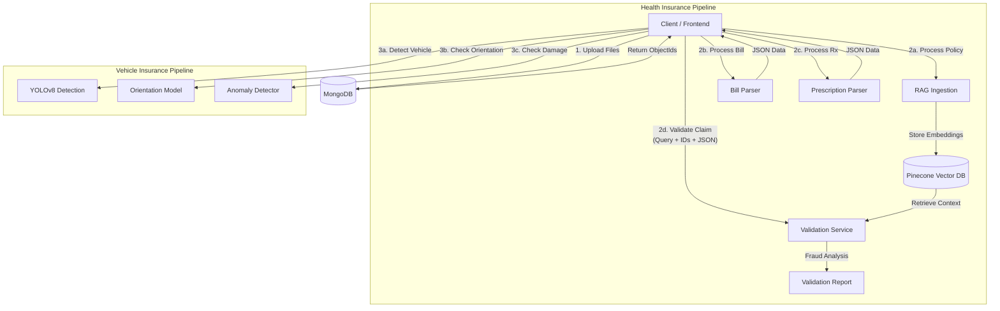

# Insurance Claim Automation Pipeline

Backend service for automating health and vehicle insurance claim processing. This system leverages RAG (Retrieval-Augmented Generation) for policy document analysis and Computer Vision for vehicle damage assessment.

## Core Features

### 1. Health Insurance Claim Validation
- **RAG Pipeline**: Ingests policy documents (PDF/Text), chunks data, and stores vector embeddings in Pinecone.
- **Anomaly Detection**: Uses `Qwen/Qwen2.5-72B-Instruct` (via Hugging Face) to cross-reference claim details against policy documents.
- **Scoring System**: Generates a validity score (0-100) and detailed analysis report for claims officers.

### 2. Vehicle Insurance Analysis
- **Object Detection**: YOLOv8 integration for detecting vehicles in claim images.
- **Damage/Orientation Analysis**: Custom TensorFlow Lite model for identifying vehicle parts and orientation.
- **RC Parsing**: OCR extraction for Registration Certificates using Tesseract.

## User Flow & Architecture

### System Architecture Diagram



### 1. Document Ingestion (Prerequisite)
Before any processing, all documents (Policy PDFs, Medical Bills, Prescriptions, Vehicle Images) must be uploaded to the system.
1.  **Upload**: The frontend/client uploads the file to the MongoDB `uploads` collection.
2.  **Storage**: The file is stored as binary data, and an `ObjectId` is returned.
3.  **Reference**: This `ObjectId` is the key used in all subsequent API calls.

### 2. Health Insurance Claim Workflow
This workflow automates the verification of medical claims against policy documents.

**Step A: Policy Indexing (One-time)**
*   **Action**: Call `POST /rag/process/{object_id}` with the ID of the Policy PDF.
*   **Process**:
    1.  System fetches PDF from MongoDB.
    2.  Extracts text and splits it into chunks.
    3.  Generates vector embeddings using `mixedbread-ai/mxbai-embed-large-v1`.
    4.  Stores vectors in **Pinecone** for fast retrieval.

**Step B: Document Processing**
*   **Action**: Call `POST /health/process_medical_bill` with the Bill Image ID.
    *   **Result**: Returns JSON with Hospital Name, Patient Name, Bill Amount, Line Items, etc.
*   **Action**: Call `POST /health/process_prescription` with the Prescription Image ID.
    *   **Result**: Returns JSON with Doctor Name, Diagnosis, Prescribed Medicines, etc.

**Step C: Claim Validation**
*   **Action**: Call `POST /health/validate_claim`
*   **Payload**:
    ```json
    {
      "object_ids": ["<Policy_Doc_ID>"],
      "query": "Claim for viral fever treatment...",
      "medical_bill_data": { ...result from Step B... },
      "prescription_data": { ...result from Step B... }
    }
    ```
*   **Process**:
    1.  **Context Retrieval**: System searches Pinecone for policy clauses relevant to the query.
    2.  **Cross-Referencing**: The LLM compares the Policy Context vs. Extracted Bill Data vs. Extracted Prescription Data.
    3.  **Fraud Check**: Checks for date mismatches, unprescribed items, and policy exclusions.
*   **Output**: A detailed report with **Fraud Probability Score**, **Status** (Valid/Suspicious), and **Reasoning**.

### 3. Vehicle Insurance Claim Workflow
This workflow assesses vehicle damage and validates evidence.

**Step A: Vehicle Detection**
*   **Action**: Call `POST /vehicle/detect_vehicle` with the Image ID.
*   **Process**: Uses YOLOv8 to confirm if a vehicle is present and count the number of vehicles.

**Step B: Orientation & Damage Analysis**
*   **Action**: Call `POST /vehicle/orientation_detection` with the Image ID.
*   **Process**: Uses a custom TFLite model to determine the angle (Front, Back, Side) and annotate detections.

**Step C: Anomaly Detection**
*   **Action**: Call `POST /vehicle/vehicle/anomaly-detection` with the Image ID.
*   **Process**: Runs a specialized model to detect specific anomalies (dents, scratches, broken glass).

## Tech Stack

- **Framework**: FastAPI
- **Vector DB**: Pinecone (Serverless)
- **Database**: MongoDB
- **LLM Inference**: Hugging Face Inference API
- **Embeddings**: `mixedbread-ai/mxbai-embed-large-v1` via SentenceTransformers
- **Vision**: Ultralytics YOLO, TensorFlow Lite, OpenCV
- **Package Manager**: uv

## Setup & Installation

### Prerequisites
- Python 3.12+
- Tesseract OCR installed and in PATH
- MongoDB instance
- Pinecone API Key
- Hugging Face API Token

### Installation

1. **Clone the repository**
   ```bash
   git clone <repository-url>
   cd insurance_claim_project
   ```

2. **Install dependencies using uv**
   ```bash
   uv sync
   ```
   *Alternatively, using pip:*
   ```bash
   pip install -r requirements.txt
   ```

3. **Environment Configuration**
   Create a `.env` file in the root directory:
   ```ini
   MONGO_URL=mongodb://localhost:27017/insurance
   PINECONE_API_KEY=your_pinecone_key
   HF_API_TOKEN=your_huggingface_token
   # OPENAI_API_KEY=... (Optional, if switching back to OpenAI)
   ```

## API Reference

### Health Insurance

#### 1. Process Policy Document (RAG)
Triggers the ingestion pipeline: extracts text from PDF, chunks it, and uploads vectors to Pinecone.

- **Endpoint**: `POST /rag/process/{object_id}`
- **Path Param**: `object_id` (MongoDB ObjectId of the uploaded document)

#### 2. Process Medical Bill
Extracts structured data from a medical bill image.
- **Endpoint**: `POST /health/process_medical_bill`
- **Body**: `{"object_id": "..."}`

#### 3. Process Prescription
Extracts structured data from a doctor's prescription image.
- **Endpoint**: `POST /health/process_prescription`
- **Body**: `{"object_id": "..."}`

#### 4. Validate Claim
Analyzes a claim query against specific policy documents and extracted evidence.

- **Endpoint**: `POST /health/validate_claim`
- **Body**:
  ```json
  {
    "object_ids": ["6578f...", "6579a..."],
    "query": "Claim for knee surgery under policy 12345. Bill amount $5000.",
    "medical_bill_data": { ... },
    "prescription_data": { ... }
  }
  ```
- **Response**:
  ```json
  {
    "analysis": "Claim Status: VALID\nFraud Probability Score: 15\n..."
  }
  ```

### Vehicle Insurance

#### 1. Detect Vehicle
- **Endpoint**: `POST /vehicle/detect_vehicle`
- **Body**: `{"object_id": "..."}`
- **Returns**: Count and bounding boxes of vehicles.

#### 2. Orientation Analysis
- **Endpoint**: `POST /vehicle/orientation_detection`
- **Body**: `{"object_id": "..."}`
- **Returns**: Classification of vehicle angle/side.

#### 3. Anomaly Detection
- **Endpoint**: `POST /vehicle/vehicle/anomaly-detection`
- **Body**: `{"object_id": "..."}`
- **Returns**: List of detected damages/anomalies.

## Project Structure

```
.
├── app/
│   ├── database.py           # MongoDB connection
│   ├── main.py              # Application entry point
│   ├── routes/              # API Route definitions
│   │   ├── health_routes.py
│   │   ├── vehicle_routes.py
│   │   └── rag_routes.py
│   └── services/            # Business logic
│       ├── health_service.py # LLM & Pinecone logic
│       ├── RAG_init.py       # Document processing & Embedding
│       ├── hf_query.py       # Hugging Face API wrapper
│       ├── model_analyzer.py # TFLite inference
│       └── rc_detector.py    # OCR logic
├── weights/                 # ML Model weights
├── notebooks/               # Prototyping notebooks
└── pyproject.toml           # Dependency configuration
```

## Development Notes

- **PDF Handling**: The system automatically detects PDF binary data in MongoDB `data` fields and uses `pypdf` to extract text before embedding.
- **Model Weights**: Ensure `yolov5su.pt` and `best-fp16.tflite` are present in the `weights/` directory for vehicle analysis features to work.
