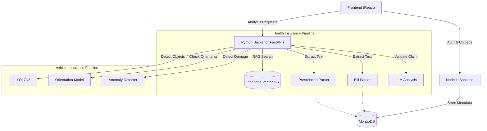
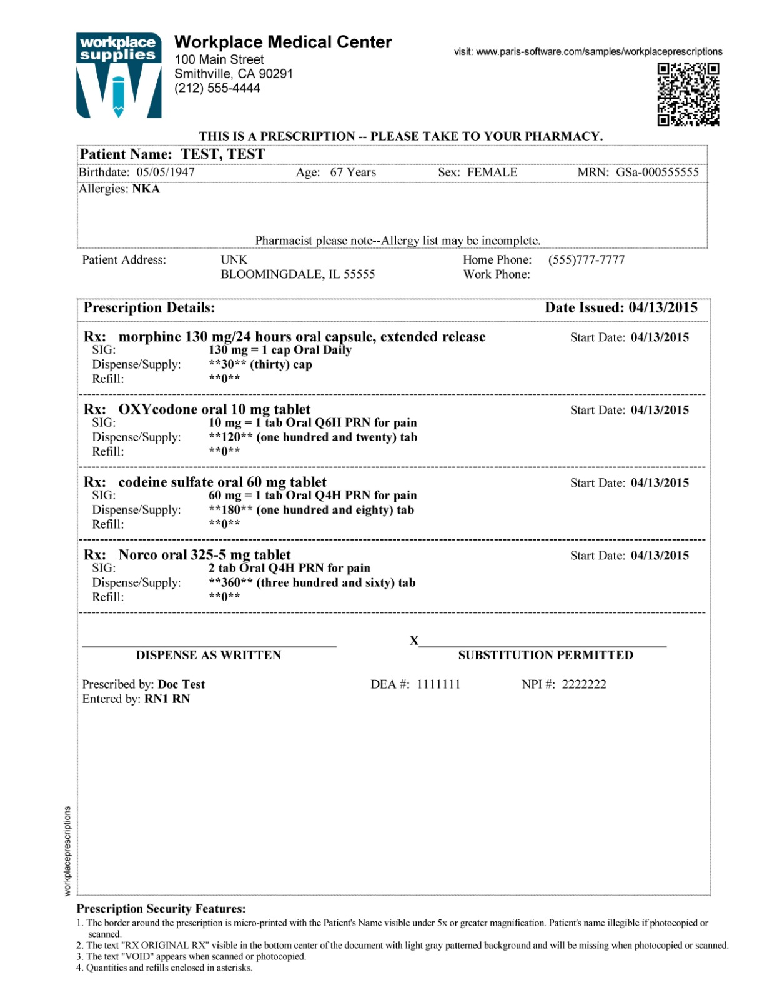

# Insurance Claim Automation Pipeline

Backend service for automating health and vehicle insurance claim processing. This system leverages RAG (Retrieval-Augmented Generation) for policy document analysis and Computer Vision for vehicle damage assessment.

## Core Features

### 1. Health Insurance Claim Validation
- **RAG Pipeline**: Ingests policy documents (PDF/Text), chunks data, and stores vector embeddings in Pinecone.
- **Anomaly Detection**: Uses `Qwen/Qwen2.5-72B-Instruct` (via Hugging Face) to cross-reference claim details against policy documents.
- **Scoring System**: Generates a validity score (0-100) and detailed analysis report for claims officers.

### 2. Vehicle Insurance Analysis
- **Object Detection**: YOLOv8 integration for detecting vehicles in claim images.
- **Damage/Orientation Analysis**: Custom TensorFlow Lite model for identifying vehicle parts and orientation.
- **RC Parsing**: OCR extraction for Registration Certificates using Tesseract.

## Prerequisites

Before running the project locally, ensure you have the following installed:

- **Python 3.12+**
- **Node.js & npm**
- **Docker & Docker Compose** (Optional, for containerized deployment)
- **Tesseract OCR**: **CRITICAL** for document parsing (Medical Bills, Prescriptions, RC).
    - **Windows**: 
        1. Download the installer from [UB-Mannheim/tesseract](https://github.com/UB-Mannheim/tesseract/wiki).
        2. Run the installer.
        3. **Important**: Add the installation path (e.g., `C:\Program Files\Tesseract-OCR`) to your System PATH environment variable.
        4. Alternatively, the application will attempt to auto-detect it in standard locations.
    - **Linux**: `sudo apt-get install tesseract-ocr`
    - **macOS**: `brew install tesseract`

## Docker Setup

To run the entire stack (Frontend, Node.js Backend, Python Backend) using Docker:

1.  **Environment Variables**: Create a `.env` file in the root directory.
2.  **Build and Run**:
    ```bash
    docker-compose up --build
    ```
3.  **Access Services**:
    - **Frontend**: [http://localhost:8080](http://localhost:8080)
    - **Node.js Backend**: [http://localhost:3000](http://localhost:3000)
    - **Python Backend**: [http://localhost:8000](http://localhost:8000)

## User Flow & Architecture

### System Architecture Diagram



## API Reference

### Python Backend (FastAPI) - Port 8000

#### 1. Process Medical Bill
Extracts details from a medical bill image.


- **Endpoint**: `POST /process_medical_bill`
- **Request**:
  ```json
  {
    "object_id": "string"
  }
  ```
- **Response**:
  ```json
  {
      "is_medical_bill": true,
      "bill_details": {
          "hospital_name": "KK Women’s and Children’s Hospital",
          "patient_name": "VERCELLA VERONICA",
          "bill_number": null,
          "bill_date": "24.08.2010",
          "total_amount": "14.626.41",
          "gst_number": null,
          "items": [
              {
                  "description": "WARD (CLASS B11)",
                  "charges_before_grant": "986.00",
                  "amount": "88.00"
              },
              {
                  "description": "WARD (CLASS 82)",
                  "charges_before_grant": "840.00",
                  "amount": "880.00"
              },
              {
                  "description": "DAILY TREATMENT FEE",
                  "charges_before_grant": "677.60",
                  "amount": "677.480"
              },
              {
                  "description": "LABORATORY INVESTIGATIONS",
                  "charges_before_grant": "5.645.098",
                  "amount": "4.646.08"
              },
              {
                  "description": "SPECIALISED INVESTIGATIONS",
                  "charges_before_grant": "2081.31",
                  "amount": "2051.31"
              },
              {
                  "description": "DRUGS & PRESCRIPTIONS 1 INJECTIONS",
                  "charges_before_grant": "1.292.97",
                  "amount": "120277"
              },
              {
                  "description": "WARD PROCEDURES",
                  "charges_before_grant": "76066",
                  "amount": "76065"
              },
              {
                  "description": "CONSUMABLES",
                  "charges_before_grant": "288.00",
                  "amount": "268.00"
              },
              {
                  "description": "PROFESSIONAL FEES DOCTOR",
                  "charges_before_grant": "124.00",
                  "amount": "121.00"
              },
              {
                  "description": "OTHER PROCEDURES",
                  "charges_before_grant": "22.00",
                  "amount": "22.00"
              }
          ]
      }
  }
  ```

#### 2. Process Prescription
Extracts details from a doctor's prescription.



- **Endpoint**: `POST /process_prescription`
- **Request**:
  ```json
  {
    "object_id": "string"
  }
  ```
- **Response**:
  ```json
  {
      "is_prescription": true,
      "prescription_details": {
          "doctor_name": "Doc Test DFA",
          "hospital_clinic_name": "Workplace Medical Center",
          "patient_name": "TEST, TEST",
          "date": "04/13/2015",
          "diagnosis": null,
          "medicines": [
              {
                  "name": "morphine 130 mg/24 hours oral capsule, extended release",
                  "dosage": "130 mg",
                  "frequency": "1 cap Oral Daily"
              },
              {
                  "name": "OXYcodone oral 10 mg tablet",
                  "dosage": "10 mg",
                  "frequency": "1 tab Oral Q6H PRN for pain"
              },
              {
                  "name": "codeine sulfate oral 60 mg tablet",
                  "dosage": "60 mg",
                  "frequency": "1 tab Oral Q4H PRN for pain"
              },
              {
                  "name": "Norco oral 325-5 mg tablet",
                  "dosage": "325-5 mg",
                  "frequency": "2 tab Oral Q4H PRN for pain"
              }
          ],
          "advice": "DISPENSE AS WRITTEN SUBSTITUTION PERMITTED"
      }
  }
  ```

#### 3. Validate Claim
Validates a health claim against policy documents.
- **Endpoint**: `POST /validate_claim`
- **Request**:
  ```json
  {
    "object_ids": ["693fd80fdd0897ee5ecd0613"],
    "query": "will my two days operation of leg is covered or not",
    "medical_bill_ids": ["6947a230aa19e28e2f31d523"],
    "prescription_ids": ["69479f1f19b579dfafea785b"]
  }
  ```
- **Response**:
  ```json
  {
      "analysis": "**Claim Status:** SUSPICIOUS\n\n**Fraud Probability Score:** 75 (High Risk)\n\n**Key Discrepancies & Fraud Indicators:**\n* **Patient Name Mismatch:** The patient name on the medical bill is \"VERCELLA VERONICA,\" while the prescription lists the patient as \"TEST, TEST.\" This is a significant discrepancy that raises concerns about the authenticity of the documents.\n* **Date Mismatch:** The medical bill is dated August 24, 2010, while the prescription is dated April 13, 2015. The bill predates the prescription by nearly five years, which is highly unusual and suggests potential fraud.\n..."
  }
  ```

#### 4. RAG Processing
Ingests a document into the RAG system.
- **Endpoint**: `POST /process/{object_id}`
- **Request**: Path parameter `object_id`
- **Response**:
  ```json
  {
      "message": "Document processed and uploaded to Pinecone successfully",
      "object_id": "693fd80fdd0897ee5ecd0613"
  }
  ```

#### 5. Detect Vehicle
Detects vehicles in an image using YOLO.
- **Endpoint**: `POST /detect_vehicle`
- **Request**:
  ```json
  {
    "object_id": "string"
  }
  ```
- **Response**:
  ```json
  {
      "vehicle_counter": 1,
      "image_size": [
          194,
          259
      ],
      "vehicle_data": [
          [
              2.0,
              0.3007952570915222,
              [
                  0.008064555935561657,
                  0.07589368522167206,
                  0.07089917361736298,
                  0.26089179515838623
              ]
          ]
      ]
  }
  ```

#### 6. Orientation Detection
Analyzes vehicle orientation.
- **Endpoint**: `POST /orientation_detection`
- **Request**:
  ```json
  {
    "object_id": "string"
  }
  ```
- **Response**:
  ```json
  {
      "vehicle_count": 3,
      "image_dimensions": [
          259,
          194
      ],
      "detections": [
          [
              "motorcycle_side",
              1.0,
              [
                  0.0,
                  0.0,
                  0.8266843557357788,
                  1.0
              ]
          ],
          [
              "motorcycle_side",
              0.94,
              [
                  0.41126778721809387,
                  0.01994311809539795,
                  1.0,
                  1.0
              ]
          ],
          [
              "motorcycle_side",
              0.52,
              [
                  8.459389209747314e-05,
                  0.0,
                  0.3739511966705322,
                  0.9840468168258667
              ]
          ]
      ],
      "annotated_image_path": "A:\\insurance_claim_project\\output_images\\annotated_image72.jpeg"
  }
  ```

#### 7. Vehicle Anomaly Detection
Detects damage or anomalies on a vehicle.
- **Endpoint**: `POST /vehicle/anomaly-detection`
- **Request**:
  ```json
  {
    "object_id": "string"
  }
  ```
- **Response**:
  ```json
  {
      "result": {
          "predicted_class": "Scratch",
          "probability": 0.9609728455543518
      }
  }
  ```

#### 8. Process Claim Workflow
Full vehicle claim processing workflow.
- **Endpoint**: `POST /process_claim_workflow`
- **Request**:
  ```json
  {
    "image_ids": ["string"],
    "policy_id": "string",
    "user_description": "string"
  }
  ```
- **Response**:
  ```json
  {
      "status": "success",
      "vehicle_analysis": [
          {
              "image_id": "6943cef480b08dbbf1d18077",
              "vehicle_count": 3,
              "detections": [
                  [
                      "motorcycle_side",
                      1.0,
                      [
                          0.0,
                          0.0,
                          0.8266843557357788,
                          1.0
                      ]
                  ],
                  [
                      "motorcycle_side",
                      0.94,
                      [
                          0.41126778721809387,
                          0.01994311809539795,
                          1.0,
                          1.0
                      ]
                  ],
                  [
                      "motorcycle_side",
                      0.52,
                      [
                          8.459389209747314e-05,
                          0.0,
                          0.3739511966705322,
                          0.9840468168258667
                      ]
                  ]
              ]
          },
          {
              "image_id": "6943ceef80b08dbbf1d18075",
              "vehicle_count": 0,
              "detections": []
          },
          {
              "image_id": "6943cee980b08dbbf1d18073",
              "vehicle_count": 2,
              "detections": [
                  [
                      "motorcycle_side",
                      0.99,
                      [
                          0.0,
                          0.0,
                          0.7054519653320312,
                          1.0
                      ]
                  ],
                  [
                      "motorcycle_side",
                      0.88,
                      [
                          0.2806297242641449,
                          0.0,
                          1.0,
                          1.0
                      ]
                  ]
              ]
          },
          {
              "image_id": "6943cee380b08dbbf1d18071",
              "vehicle_count": 0,
              "detections": []
          }
      ],
      "anomaly_analysis": [
          {
              "image_id": "6943cef480b08dbbf1d18077",
              "anomaly": {
                  "predicted_class": "Scratch",
                  "probability": 0.9609728455543518
              }
          },
          {
              "image_id": "6943ceef80b08dbbf1d18075",
              "anomaly": {
                  "predicted_class": "Scratch",
                  "probability": 0.9650242924690247
              }
          },
          {
              "image_id": "6943cee980b08dbbf1d18073",
              "anomaly": {
                  "predicted_class": "Scratch",
                  "probability": 0.9673997759819031
              }
          },
          {
              "image_id": "6943cee380b08dbbf1d18071",
              "anomaly": {
                  "predicted_class": "Scratch",
                  "probability": 0.9686837792396545
              }
          }
      ],
      "claim_report": "**Claim Status:** SUSPICIOUS\n\n**Validation Score:** 30\n\n**Damage Assessment Summary:**\n* The images provided show multiple instances of scratches on different motorcycles. Each scratch has a high probability score, indicating that the damage is clearly visible and consistent with being scratches. However, there are inconsistencies in the number of vehicles detected across the images, which raises concerns about the validity of the claim.\n\n**Policy Coverage Analysis:**\n* The Policy Context is not provided, so I cannot cross-reference the specific policy details. However, typical policies cover scratches under comprehensive coverage unless explicitly excluded. The lack of detailed policy information makes it difficult to provide a definitive statement on coverage.\n\n**Key Discrepancies / Fraud Flags:**\n* **Inconsistent Vehicle Counts:** The vehicle detection data shows a varying number of motorcycles in the images (3, 0, 2, 0). This inconsistency could indicate that the images were taken at different times or locations, which is unusual for a single incident.\n* **Multiple Vehicles Involved:** The claim mentions a single vehicle being scratched, but the images show multiple motorcycles with scratches. This discrepancy between the claim and the evidence is significant and requires further investigation.\n* **High Probability of Scratches Across Multiple Images:** While the scratches are clearly identified, the presence of scratches in multiple images without a clear explanation of how they occurred simultaneously is suspicious.\n\n**Final Recommendation:**\nFurther Investigation Required\n\nThe inconsistencies in the number of vehicles detected and the presence of scratches on multiple motorcycles raise significant concerns about the validity of the claim. It is recommended that the claim be reviewed in detail, including verifying the circumstances of the incident and potentially conducting a physical inspection of the vehicles involved. Additionally, obtaining the policy details will help in determining the coverage and any exclusions that may apply."
  }
  ```

### Node.js Backend (Express) - Port 3000

#### 9. Sign Up
Register a new user.
- **Endpoint**: `POST /api/auth/signup`
- **Request**:
  ```json
  {
    "name": "string",
    "email": "string",
    "role": "string",
    "password": "string"
  }
  ```
- **Response**:
  ```json
  {
      "message": "Signup successful..!"
  }
  ```

#### 10. Sign In
Authenticate a user.
- **Endpoint**: `POST /api/auth/signin`
- **Request**:
  ```json
  {
    "email": "string",
    "password": "string"
  }
  ```
- **Response**:
  ```json
  {
      "message": "Login successful",
      "token": "eyJhbGciOiJIUzI1NiIsInR5cCI6IkpXVCJ9...",
      "userId": "6578f...",
      "role": "user",
      "name": "John Doe"
  }
  ```

#### 11. Upload Vehicle Photo
Upload a photo for vehicle claims.
- **Endpoint**: `POST /api/upload/vehicle-photo`
- **Request**: Multipart Form
  - `file`: (Binary)
  - `field`: (String)
- **Response**:
  ```json
  {
      "_id": "6578f...",
      "url": "https://res.cloudinary.com/...",
      "publicId": "claims/vehicle-photos/..."
  }
  ```

## Tech Stack

- **Framework**: FastAPI
- **Vector DB**: Pinecone (Serverless)
- **Database**: MongoDB
- **LLM Inference**: Hugging Face Inference API
- **Embeddings**: `mixedbread-ai/mxbai-embed-large-v1` via SentenceTransformers
- **Vision**: Ultralytics YOLO, TensorFlow Lite, OpenCV
- **Package Manager**: uv

## Setup & Installation

### Prerequisites
- Python 3.12+
- Tesseract OCR installed and in PATH
- MongoDB instance
- Pinecone API Key
- Hugging Face API Token

### Installation

1. **Clone the repository**
   ```bash
   git clone <repository-url>
   cd insurance_claim_project
   ```

2. **Install dependencies using uv**
   ```bash
   uv sync
   ```
   *Alternatively, using pip:*
   ```bash
   pip install -r requirements.txt
   ```

3. **Environment Configuration**
   Create a `.env` file in the root directory:
   ```ini
   MONGO_URL=mongodb://localhost:27017/insurance
   PINECONE_API_KEY=your_pinecone_key
   HF_API_TOKEN=your_huggingface_token
   # OPENAI_API_KEY=... (Optional, if switching back to OpenAI)
   ```

## Project Structure

```
.
├── app/
│   ├── database.py           # MongoDB connection
│   ├── main.py              # Application entry point
│   ├── routes/              # API Route definitions
│   │   ├── health_routes.py
│   │   ├── vehicle_routes.py
│   │   └── rag_routes.py
│   └── services/            # Business logic
│       ├── health_service.py # LLM & Pinecone logic
│       ├── RAG_init.py       # Document processing & Embedding
│       ├── hf_query.py       # Hugging Face API wrapper
│       ├── model_analyzer.py # TFLite inference
│       └── rc_detector.py    # OCR logic
├── weights/                 # ML Model weights
├── notebooks/               # Prototyping notebooks
└── pyproject.toml           # Dependency configuration
```

## Development Notes

- **PDF Handling**: The system automatically detects PDF binary data in MongoDB `data` fields and uses `pypdf` to extract text before embedding.
- **Model Weights**: Ensure `yolov5su.pt` and `best-fp16.tflite` are present in the `weights/` directory for vehicle analysis features to work.
